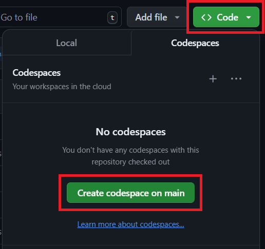
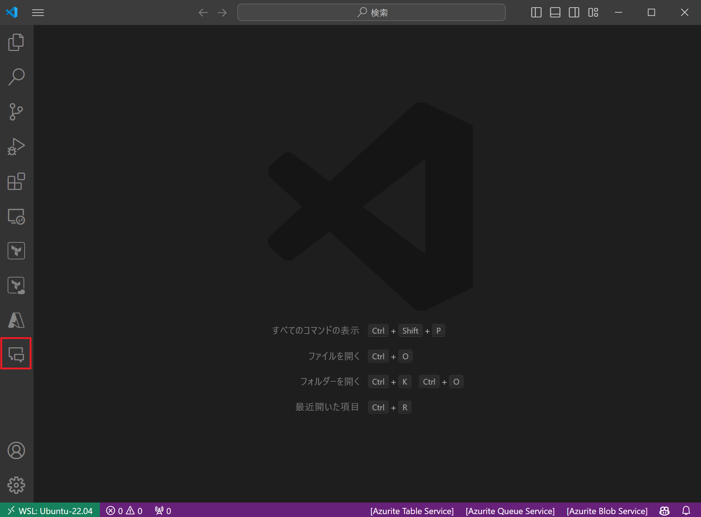

# Simple Copilot demo for C# and .NET through Visual Studio IDE


本ワークショップは、GitHub Copilot を用いた C# および .NET の開発を体験する簡単なデモです。Visual Studio Code とその拡張機能を通じて、GitHub Copilot が C# や .NET を用いた開発をどのようにサポートするか体感できます。

## 🎯 ゴール

* ワークショップを通じて単純な .NET アプリケーションを作成する

## ✍️ プログラミング言語

* C#

## 💻 IDE

- [Visual Studio Code](https://code.visualstudio.com/download)

## 📖 GitHub Copilot チートシート

GitHub Copilot の使い方については、以下のチートシートを参照してください。
| 内容 | 操作方法 |
| --- | --- |
| 1 行全ての提案を受け入れる | `Tab` キー |
| 提案をスペースごとに受け入れる | `Ctrl` + `→` キー |
| 提案を削除する | `Ctrl` + `←` キー |
| 提案を拒否する | `Esc` キー |
| 次の提案を表示する | `Alt` + `]` キー |
| 前の提案を表示する | `Alt` + `[` キー |
| 提案をまとめて表示する | `Ctrl` + `Enter` キー |

## 📖 GitHub Copilot Chat チートシート
GitHub Copilot Chat の使い方については、以下のチートシートを参照してください。
| 内容 | 操作方法 | Chat Window | Inline Chat |
| --- | --- | --- | --- |
| コードの内容を解説させる | `/explain` | 〇| 〇|
| 修正を提案させる | `/fix` | 〇| 〇|
| テストコードを提案させる | `/tests` | 〇| 〇|
| チャットの履歴を消去し、新たな会話を開始する | `/clear` | 〇| × |
| 使い方を表示する | `/help` | 〇| 〇|

※GitHub Copilot Chat 画面では `Shift` + `Enter` キーで改行が可能です

## 🗒️ ガイド

このガイドでは Visual Studio Code で GitHub Copilot を利用する手順を説明します。

### 前提条件

次の要件を満たしていることを確認してください。

* 以下の拡張機能を導入済みの [Visual Studio Code](https://code.visualstudio.com/download)
  * GitHub Copilot (`GitHub.copilot`)
  * GitHub Copilot Chat (`GitHub.copilot-chat`)
  * C# (`ms-dotnettools.csharp`)
  * .NET Install Tool (`ms-dotnettools.vscode-dotnet-runtime`)
* [.NET SDK 8.0](https://dotnet.microsoft.com/ja-jp/download)

### Step 1: Visual Studio Code を起動

任意の場所に本ワークショップ用のディレクトリ (e.g. `CopilotTraining`) を作成し、Visual Studio Code で当該ディレクトリを開いてください。

※GitHub Codespaces で受講される方 (普段 Visual Studio Code を利用されていない方) は当リポジトリから GitHub Codespaces を起動してください。



### Step 2: ソリューションおよびプロジェクトの作成

Visual Studio Code でターミナルを起動し、以下のコマンドを実行して新規のソリューションを作成します。

```Shell
dotnet new sln
```
以下が出力されることを確認してください。

```Shell
The template "Solution File" was created successfully.
```

続いて以下のコマンドを実行して新規コンソールアプリケーションのプロジェクトを作成します。

```Shell
dotnet new console -o HelloCopilot
```

以下が出力されることを確認してください。

```Shell
The template "Console App" was created successfully.

Processing post-creation actions...
Restoring /workspaces/CopilotTraining/HelloCopilot/HelloCopilot.csproj:
  Determining projects to restore...
  Restored /workspaces/CopilotTraining/HelloCopilot/HelloCopilot.csproj (in 78 ms).
Restore succeeded.
```

作成したアプリケーションをソリューションに追加します。以下のコマンドを実行してください。

```Shell
dotnet sln add HelloCopilot/HelloCopilot.csproj
```

以下が出力されることを確認してください。

```Shell
Project `HelloCopilot/HelloCopilot.csproj` added to the solution.
```

### Step 3: GitHub Copilot の状態を確認

Visual Studio Code ウィンドウの右下にある GitHub Copilot のアイコンを押下してください。


`Status: Ready` となっていれば問題ありません。


### Step 4: 最初のコードを記述

`HelloCopilot/Program.cs` を開きます。

初期状態のコードを全て削除し、以下を記述してください。

```C#
using System;
using
```

2 行目の `using` を記述すると GitHub Copilot がサジェストをしてくれます。


Tab キーを押下してサジェストを受け入れましょう。

```C#
using System;
using System.Collections.Generic;
```

受け入れたあとに改行をすると `using System.Linq` がサジェストされるのでこれも受け入れます。


最終的に以下の形になるまでサジェストを受け入れ続けてください。

```C#
using System;
using System.Collections.Generic;
using System.Linq;
using System.Text;
using System.Threading.Tasks;
```

**※全てこの通りに行かない場合があります。その場合は上記のコードをコピーして貼り付けてください※**

続いて以下のコードをコピーして最下行に貼り付けてください。

```C#
namespace HelloCopilot
{
    internal class Program
    {
        static void Main(string[] args)
        {
            //
        }
    }
}
```

`Main` メソッド内のコメント部分に以下のいずれかを追記してください。  
※以降のサンプルでは日本語で追記したものを記載します

* 英語
  * `Print out Hello, Copilot 3,000 time with incrementing index.`
* 日本語
  * `Hello, Copilot {index} を 3000 回出力する`

```C#
using System;
using System.Collections.Generic;
using System.Linq;
using System.Text;
using System.Threading.Tasks;

namespace HelloCopilot
{
    internal class Program
    {
        static void Main(string[] args)
        {
            // Hello, Copilot {index} を 3000 回出力する
        }
    }
}
```

入力を完了して改行すると GitHub Copilot からコードがサジェストされるので受け入れましょう。


ここまででコードは以下のようになります。必ずしも全く同じコードになるわけではありませんが、概ね同じようなコードになっていると思います。

```C#
using System;
using System.Collections.Generic;
using System.Linq;
using System.Text;
using System.Threading.Tasks;

namespace HelloCopilot
{
    internal class Program
    {
        static void Main(string[] args)
        {
            // Hello, Copilot {index} を 3000 回出力する
            for (int i = 0; i < 3000; i++)
            {
                Console.WriteLine($"Hello, Copilot {i}");
            }
        }
    }
}
```

意図した通りの内容になっているか、実行して確認してみましょう。コードの変更を保存し、ターミナルから以下のコマンドを実行してください。

```Shell
dotnet run --project HelloCopilot/HelloCopilot.csproj
```

以下が出力されることを確認してください。

```Shell
Hello, Copilot 0
Hello, Copilot 1
Hello, Copilot 2
.
.
.
Hello, Copilot 2997
Hello, Copilot 2998
Hello, Copilot 2999
```

### Step 5: 関数の記述

続いて関数の記述をさせてみましょう。`Program` クラスにメソッドとして追加します。`Main` メソッドの上に以下のコメントを記述してください。

* 英語
  * `// Function to sum all the numbers in a list of integers.`
* 日本語
  * `// Int の配列を受け取り中身を合計して返す関数`

以下のようなサジェストが表示されるので受け入れてください。

```C#
.
.
.
        // Int の配列を受け取り中身を合計して返す関数
        private static int Sum(int[] numbers)
        {
            int sum = 0;
            foreach (var number in numbers)
            {
                sum += number;
            }
            return sum;
        }
.
.
.
```

`Main` メソッド内に追加したメソッドを実行するコードを追記します。`Main` メソッド内の最下行をクリックして Enter を押下し改行すると、GitHub Copilot からのサジェストが表示されます。サジェストを受け入れた後改行するとさらなるサジェストが表示されるので、満足いく結果が得られそうなコードになるまで繰り返してください。

```C#
.
.
.
        static void Main(string[] args)
        {
            // Hello, Copilot {index} を 3000 回出力する
            for (int i = 0; i < 3000; i++)
            {
                Console.WriteLine($"Hello, Copilot {i}");
            }

            // 1 から 100 までの数値を持つ配列を作成
            int[] numbers = Enumerable.Range(1, 100).ToArray();

            // 配列の中身を合計
            int sum = Sum(numbers);
            Console.WriteLine($"Sum: {sum}");
        }
.
.
.
```

一通り受け入れが終わって実行可能な形になっていそうであればコードを実行してみましょう。コードの変更を保存し、ターミナルから以下のコマンドを実行してください。

```Shell
dotnet run --project HelloCopilot/HelloCopilot.csproj
```

サンプルコードの場合、実行結果は以下のようになります。

```C#
Hello, Copilot 0
Hello, Copilot 1
Hello, Copilot 2
.
.
.
Hello, Copilot 2997
Hello, Copilot 2998
Hello, Copilot 2999
Sum: 5050
```

### Step 6: より複雑な機能を追加

`Program` クラスにもう少し複雑な機能を持った関数を追加させてみましょう。`Main` メソッドの上に以下のコメントを記述してください。

* 英語
  * `// Function to randomly assign 4 digit codes to N x M matrix.`
* 日本語
  * `// 4 桁のランダムな数字を N x M 列生成する機能`

以下のようなサジェストが表示されるので受け入れてください。

```C#
.
.
.
        private static void GenerateRandomNumbers(int n, int m)
        {
            Random random = new Random();
            for (int i = 0; i < n; i++)
            {
                for (int j = 0; j < m; j++)
                {
                    Console.Write(random.Next(1000, 10000));
                    Console.Write(" ");
                }
                Console.WriteLine();
            }
        }
.
.
.
```

`Main` メソッド内に追加したメソッドを実行するコードを追記します。[先程](#step-5-関数の記述) と同じ手順で行ってください。

```C#
.
.
.
        static void Main(string[] args)
        {
            // Hello, Copilot {index} を 3000 回出力する
            for (int i = 0; i < 3000; i++)
            {
                Console.WriteLine($"Hello, Copilot {i}");
            }

            // 1 から 100 までの数値を持つ配列を作成
            int[] numbers = Enumerable.Range(1, 100).ToArray();

            // 配列の中身を合計
            int sum = Sum(numbers);
            Console.WriteLine($"Sum: {sum}");

            // 4 桁のランダムな数字を 5 x 5 列生成
            GenerateRandomNumbers(5, 5);
        }
.
.
.
```

追記が完了したらコードを実行しましょう。コードの変更を保存し、ターミナルから以下のコマンドを実行してください。

```Shell
dotnet run --project HelloCopilot/HelloCopilot.csproj
```

サンプルコードの場合、実行結果は以下のようになります。

```Shell
Hello, Copilot 0
Hello, Copilot 1
Hello, Copilot 2
.
.
.
Hello, Copilot 2999
Sum: 5050
4828 5752 1595 3975 7450 
4066 3604 7527 1956 5962 
8738 8331 4955 6979 1959 
2514 2824 1992 5990 4637 
2846 1221 4739 1395 5851 
```

### Step 7: メソッドのテストを追加

GitHub Copilot Chat を用いて、これまでに作成したメソッドのテストコードを記述しましょう。まずはテストを実行するための環境を準備します。

最初にテスト用のプロジェクトを作成します。ターミナルから以下のコマンドを実行してください。

```Shell
dotnet new mstest -o HelloCopilotTest
```

以下が出力されることを確認してください。

```Shell
The template "MSTest Test Project" was created successfully.

Processing post-creation actions...
Restoring /workspaces/CopilotTraining/HelloCopilotTest/HelloCopilotTest.csproj:
  Determining projects to restore...
  Restored /workspaces/CopilotTraining/HelloCopilotTest/HelloCopilotTest.csproj (in 539 ms).
Restore succeeded.
```

作成したプロジェクトをソリューションへ追加します。ターミナルから以下のコマンドを実行してください。

```Shell
dotnet sln add HelloCopilotTest/HelloCopilotTest.csproj
```

以下が出力されることを確認してください。

```Shell
Project `HelloCopilotTest/HelloCopilotTest.csproj` added to the solution.
```

テスト用プロジェクトからテスト対象のアプリケーションプロジェクトに対するプロジェクト参照を追加します。ターミナルから以下のコマンドを実行してください。

```Shell
dotnet add HelloCopilotTest/HelloCopilotTest.csproj reference HelloCopilot/HelloCopilot.csproj
```

以下が出力されることを確認してください。

```Shell
Reference `..\HelloCopilot\HelloCopilot.csproj` added to the project.
```

GitHub Copilot Chat にテストコードの生成を依頼してみましょう。Visual Studio Code のウィンドウ左にあるバーから GitHub Copilot Chat を開きます。



以下の文で問いかけてください (※**もしクラス名やメソッド名が異なる場合は書き換えてください**※)。

```
Program クラス内にある Sum メソッドと GenerateRandomNumbers メソッドのテストを実行するコードを生成してください。

テストツールは MSTest を利用します。
```

サンプルではテストコードに加え、テストプロジェクトの準備や実行方法も回答してくれました。以下は生成されたテストコードのみを抜粋しています。

```C#
using Microsoft.VisualStudio.TestTools.UnitTesting;
using System;
using System.Collections.Generic;

namespace YourNamespace.Tests
{
    [TestClass]
    public class ProgramTests
    {
        [TestMethod]
        public void TestSum()
        {
            // Arrange
            int a = 5;
            int b = 10;
            int expected = 15;

            // Act
            int result = Program.Sum(a, b);

            // Assert
            Assert.AreEqual(expected, result);
        }

        [TestMethod]
        public void TestGenerateRandomNumbers()
        {
            // Arrange
            int count = 5;
            int min = 1;
            int max = 10;

            // Act
            List<int> result = Program.GenerateRandomNumbers(count, min, max);

            // Assert
            Assert.AreEqual(count, result.Count);
            foreach (var number in result)
            {
                Assert.IsTrue(number >= min && number <= max);
            }
        }
    }
}
```

生成されたテストコードを準備しておいたテストプロジェクト内に記述します。`HelloCopilotTest/UnitTest1.cs` を開いて生成されたコードを貼り付けて下さい。

完了したらテストを実行してみましょう。コードの変更を保存し、ターミナルから以下のコマンドを実行してください。

```Shell
dotnet test
```

以下のようなエラーが発生します。

```Shell
  Determining projects to restore...
  All projects are up-to-date for restore.
  HelloCopilot -> /workspaces/csharp-simple-demo/HelloCopilot/bin/Debug/net8.0/HelloCopilot.dll
/workspaces/csharp-simple-demo/HelloCopilotTest/UnitTest1.cs(19,26): error CS0103: The name 'Program' does not exist in the current context [/workspaces/csharp-simple-demo/HelloCopilotTest/HelloCopilotTest.csproj]
/workspaces/csharp-simple-demo/HelloCopilotTest/UnitTest1.cs(34,32): error CS0103: The name 'Program' does not exist in the current context [/workspaces/csharp-simple-demo/HelloCopilotTest/HelloCopilotTest.csproj]
```

GitHub Copilot Chat にエラーの原因を尋ねてみましょう。以下の文で問いかけてください。

```
error CS0103: The name 'Program' does not exist in the current context

上記のエラーが発生します。原因は何ですか？
```

原因と対処について回答してくれます。サンプルでは以下のように回答してくれました。

---
エラー `CS0103: The name 'Program' does not exist in the current context` は、Program クラスが現在のコンテキストで見つからないことを示しています。これは通常、以下のいずれかの理由で発生します：

1. Program クラスが存在しない。
2. Program クラスが異なる名前空間に存在する。
3. Program クラスが正しくインポートされていない。

以下の手順で問題を解決できます：

1. Program クラスが存在することを確認します。
2. Program クラスが異なる名前空間にある場合、その名前空間をインポートします。

例えば、`Program` クラスが `YourNamespace` に存在する場合、以下のように名前空間をインポートします：

```C#
using YourNamespace;
```

また、`Program` クラスが同じプロジェクト内に存在することを確認してください。

修正例：

```C#
using Microsoft.VisualStudio.TestTools.UnitTesting;
using System;
using System.Collections.Generic;
using YourNamespace; // 追加

namespace YourNamespace.Tests
{
    [TestClass]
    public class ProgramTests
    {
        [TestMethod]
        public void TestSum()
        {
            // Arrange
            int a = 5;
            int b = 10;
            int expected = 15;

            // Act
            int result = Program.Sum(a, b);

            // Assert
            Assert.AreEqual(expected, result);
        }

        [TestMethod]
        public void TestGenerateRandomNumbers()
        {
            // テストメソッドの内容
        }
    }
}
```

このように、`YourNamespace` をインポートすることで、`Program` クラスが見つかるようになります。

---

上記の通り対応してみましょう。`HelloCopilot/Program.cs` を開き、インポート文を追加したあとに再度テストを実行します。コードの変更を保存し、ターミナルから以下のコマンドを実行してください。

```Shell
dotnet test
```

今度は以下のようなエラーが出力されます。

```Shell
  Determining projects to restore...
  All projects are up-to-date for restore.
  HelloCopilot -> /workspaces/csharp-simple-demo/HelloCopilot/bin/Debug/net8.0/HelloCopilot.dll
/workspaces/csharp-simple-demo/HelloCopilotTest/UnitTest1.cs(20,26): error CS0122: 'Program' is inaccessible due to its protection level [/workspaces/csharp-simple-demo/HelloCopilotTest/HelloCopilotTest.csproj]
/workspaces/csharp-simple-demo/HelloCopilotTest/UnitTest1.cs(35,32): error CS0122: 'Program' is inaccessible due to its protection level [/workspaces/csharp-simple-demo/HelloCopilotTest/HelloCopilotTest.csproj]
```

<br>


**💡 Tips 💡**

GitHub Copilot Chat に問いかける際、`#terminalLastCommand` と入力したあとに質問すると、ターミナルで実行したコマンドの最終結果をもとに回答してくれます。

<br>

どうやら先程の対応では不十分だったようです。GitHub Copilot や GitHub Copilot Chat は必ず完全な回答を返してくれるわけではありません。何度かやり取りを繰り返してテストを完遂してみましょう。サンプルでは最終的に以下のコードになりました。

```C#
// HelloCopilot/Program.cs
using System;
using System.Collections.Generic;
using System.Linq;
using System.Text;
using System.Threading.Tasks;

namespace HelloCopilot
{
    public class Program
    {
        // Int の配列を受け取り中身を合計して返す関数
        public static int Sum(int[] numbers)
        {
            int sum = 0;
            foreach (var number in numbers)
            {
                sum += number;
            }
            return sum;
        }

        // 4 桁のランダムな数字を N x M 列生成する機能
        public static void GenerateRandomNumbers(int n, int m)
        {
            Random random = new Random();
            for (int i = 0; i < n; i++)
            {
                for (int j = 0; j < m; j++)
                {
                    Console.Write(random.Next(1000, 10000));
                    Console.Write(" ");
                }
                Console.WriteLine();
            }
        }

        static void Main(string[] args)
        {
            // Hello, Copilot {index} を 3000 回出力する
            for (int i = 0; i < 3000; i++)
            {
                Console.WriteLine($"Hello, Copilot {i}");
            }

            // 1 から 100 までの数値を持つ配列を作成
            int[] numbers = Enumerable.Range(1, 100).ToArray();

            // 配列の中身を合計
            int sum = Sum(numbers);
            Console.WriteLine($"Sum: {sum}");

            // 4 桁のランダムな数字を 5 x 5 列生成
            GenerateRandomNumbers(5, 5);
        }
    }
}
```

```C#
// HelloCopilotTest/UnitTest1.cs
using System;
using System.Collections.Generic;
using Microsoft.VisualStudio.TestTools.UnitTesting;
using HelloCopilot;

namespace HelloCopilotTest
{
    [TestClass]
    public class ProgramTests
    {
        [TestMethod]
        public void Sum_ShouldReturnCorrectSum()
        {
            // Arrange
            int[] numbers = { 1, 2, 3, 4, 5 };
            int expectedSum = 15;

            // Act
            int actualSum = Program.Sum(numbers);

            // Assert
            Assert.AreEqual(expectedSum, actualSum);
        }

        [TestMethod]
        public void GenerateRandomNumbers_ShouldGenerateCorrectNumberOfRowsAndColumns()
        {
            // Arrange
            int n = 3;
            int m = 4;
            var output = new System.IO.StringWriter();
            var originalOut = Console.Out;
            Console.SetOut(output);

            try
            {
                // Act
                Program.GenerateRandomNumbers(n, m);

                // Assert
                var consoleOutput = output.ToString();
                var lines = consoleOutput.Split(new[] { Environment.NewLine }, StringSplitOptions.RemoveEmptyEntries);
                Assert.AreEqual(n, lines.Length);
                foreach (var line in lines)
                {
                    var numbers = line.Split(new[] { ' ' }, StringSplitOptions.RemoveEmptyEntries);
                    Assert.AreEqual(m, numbers.Length);
                    foreach (var number in numbers)
                    {
                        Assert.IsTrue(int.TryParse(number, out int result));
                        Assert.IsTrue(result >= 1000 && result <= 9999);
                    }
                }
            }
            finally
            {
                // Restore the original Console.Out
                Console.SetOut(originalOut);
            }
        }
    }
}
```

```Shell
# 実行結果
  Determining projects to restore...
  All projects are up-to-date for restore.
  HelloCopilot -> /workspaces/csharp-simple-demo/HelloCopilot/bin/Debug/net8.0/HelloCopilot.dll
  HelloCopilotTest -> /workspaces/csharp-simple-demo/HelloCopilotTest/bin/Debug/net8.0/HelloCopilotTest.dll
Test run for /workspaces/csharp-simple-demo/HelloCopilotTest/bin/Debug/net8.0/HelloCopilotTest.dll (.NETCoreApp,Version=v8.0)
VSTest version 17.11.0 (x64)

Starting test execution, please wait...
A total of 1 test files matched the specified pattern.

Passed!  - Failed:     0, Passed:     2, Skipped:     0, Total:     2, Duration: 64 ms - HelloCopilotTest.dll (net8.0)
```

以上でワークショップは終了です。
