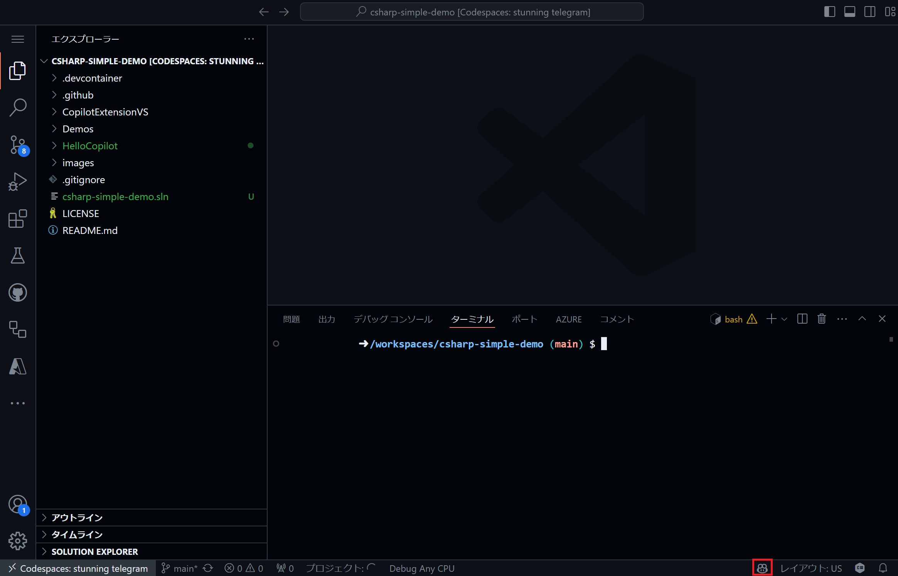
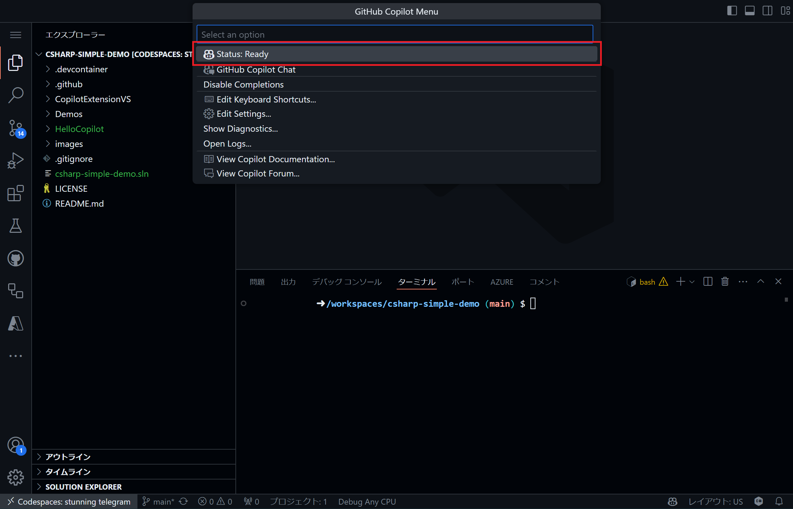
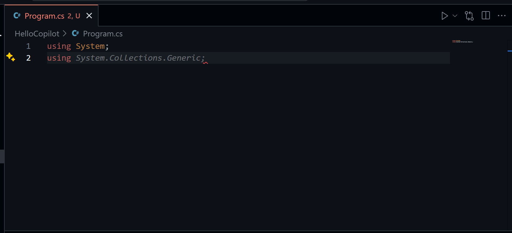
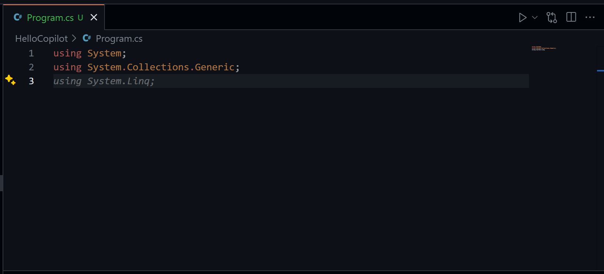
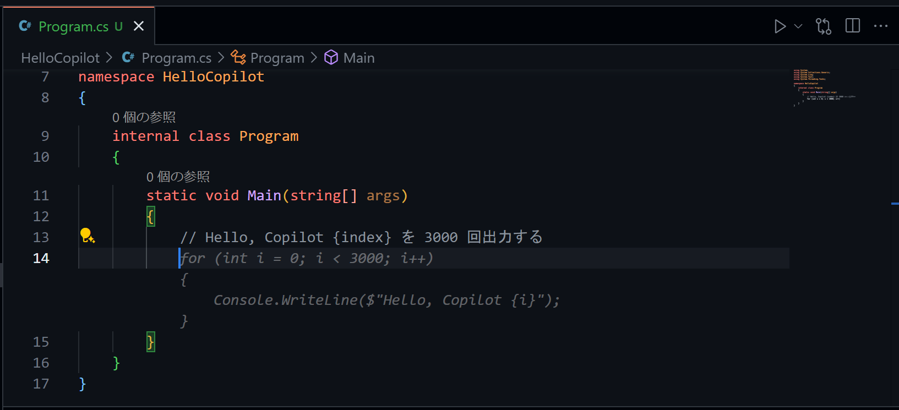

# Simple Copilot demo for C# and .NET through Visual Studio IDE


本ワークショップは、GitHub Copilot を用いた C# および .NET の開発を体験する簡単なデモです。Visual Studio Code とその拡張機能を通じて、GitHub Copilot が C# や .NET を用いた開発をどのようにサポートするか体感できます。

## 🎯 ゴール

* ワークショップを通じて単純な .NET アプリケーションを作成する

## ✍️ プログラミング言語

* C#

## 💻 IDE

- [Visual Studio Code](https://code.visualstudio.com/download)

## 🗒️ ガイド

このガイドでは Visual Studio Code で Copilot を利用する手順を説明します。

### 前提条件

次の要件を満たしていることを確認してください。

* 以下の拡張機能を導入済みの [Visual Studio Code](https://code.visualstudio.com/download)
  * `GitHub.copilot`
  * `GitHub.copilot-chat`
  * `ms-dotnettools.csharp`
  * `ms-dotnettools.vscode-dotnet-runtime`
* .NET SDK 8.0

### Step 1: Visual Studio Code を起動

任意の場所に本ワークショップ用のディレクトリ (e.g. `CopilotTraining`) を作成し、Visual Studio Code で当該ディレクトリを開いてください。

### Step 2: ソリューションおよびプロジェクトの作成

Visual Studio Code でターミナルを起動し、以下のコマンドを実行して新規のソリューションを作成します。

```Shell
dotnet new sln
```
以下が出力されることを確認してください。

```Shell
The template "Solution File" was created successfully.
```

続いて以下のコマンドを実行して新規コンソールアプリケーションのプロジェクトを作成します。

```Shell
dotnet new console -o HelloCopilot
```

以下が出力されることを確認してください。

```Shell
The template "Console App" was created successfully.

Processing post-creation actions...
Restoring /workspaces/CopilotTraining/HelloCopilot/HelloCopilot.csproj:
  Determining projects to restore...
  Restored /workspaces/CopilotTraining/HelloCopilot/HelloCopilot.csproj (in 78 ms).
Restore succeeded.
```

作成したアプリケーションをソリューションに追加します。以下のコマンドを実行してください。

```Shell
dotnet sln add HelloCopilot/HelloCopilot.csproj
```

以下が出力されることを確認してください。

```Shell
Project `HelloCopilot/HelloCopilot.csproj` added to the solution.
```

### Step 3: GitHub Copilot の状態を確認

Visual Studio Code ウィンドウの右下にある GitHub Copilot のアイコンを押下してください。



`Status: Ready` となっていれば問題ありません。



### Step 4: 最初のコードを記述

`HelloCopilot/Program.cs` を開きます。

初期状態のコードを全て削除し、以下を記述してください。

```C#
using System;
using
```

2 行目の `using` を記述すると GitHub Copilot がサジェストをしてくれます。



Tab キーを押下してサジェストを受け入れましょう。

```C#
using System;
using System.Collections.Generic;
```

受け入れたあとに改行をすると `using System.Linq` がサジェストされるのでこれも受け入れます。



最終的に以下の形になるまでサジェストを受け入れ続けてください。

```C#
using System;
using System.Collections.Generic;
using System.Linq;
using System.Text;
using System.Threading.Tasks;
```

続いて以下のコードをコピーして最下行に貼り付けてください。

```C#
namespace HelloCopilot
{
    internal class Program
    {
        static void Main(string[] args)
        {
            //
        }
    }
}
```

`Main` メソッド内のコメント部分に以下のいずれかを追記してください。  
※以降のサンプルでは日本語で追記したものを記載します

* 英語
  * `Print out Hello, Copilot 3,000 time with incrementing index.`
* 日本語
  * `Hello, Copilot {index} を 3000 回出力する`

```C#
using System;
using System.Collections.Generic;
using System.Linq;
using System.Text;
using System.Threading.Tasks;

namespace HelloCopilot
{
    internal class Program
    {
        static void Main(string[] args)
        {
            // Hello, Copilot {index} を 3000 回出力する
        }
    }
}
```

入力を完了して改行すると Copilot からコードがサジェストされるので受け入れましょう。



ここまででコードは以下のようになります。必ずしも全く同じコードになるわけではありませんが、概ね同じようなコードになっていると思います。

```C#
using System;
using System.Collections.Generic;
using System.Linq;
using System.Text;
using System.Threading.Tasks;

namespace HelloCopilot
{
    internal class Program
    {
        static void Main(string[] args)
        {
            // Hello, Copilot {index} を 3000 回出力する
            for (int i = 0; i < 3000; i++)
            {
                Console.WriteLine($"Hello, Copilot {i}");
            }
        }
    }
}
```

意図した通りの内容になっているか、実行して確認してみましょう。ターミナルから以下のコマンドを実行してください。

```Shell
dotnet run --project HelloCopilot/HelloCopilot.csproj
```

以下が出力されることを確認してください。

```Shell
Hello, Copilot 0
Hello, Copilot 1
Hello, Copilot 2
.
.
.
Hello, Copilot 2997
Hello, Copilot 2998
Hello, Copilot 2999
```

### Step 5: 関数の記述

続いて関数の記述をさせてみましょう。`Program` クラスにメソッドとして追加します。`Main` メソッドの上に以下のコメントを記述してください。

* 英語
  * `Function to sum all the numbers in a list of integers.`
* 日本語
  * `Int の配列を受け取り中身を合計して返す関数`

以下のようなサジェストが表示されるので受け入れてください。

```C#
.
.
.
        // Int の配列を受け取り中身を合計して返す関数
        private static int Sum(int[] numbers)
        {
            int sum = 0;
            foreach (var number in numbers)
            {
                sum += number;
            }
            return sum;
        }
.
.
.
```

`Main` メソッド内に追加したメソッドを実行するコードを追記します。`Main` メソッド内の最下行をクリックして Enter を押下し改行すると、Copilot からのサジェストが表示されます。サジェストを受け入れた後改行するとさらなるサジェストが表示されるので、満足いく結果が得られそうなコードになるまで繰り返してください。

```C#
.
.
.
        static void Main(string[] args)
        {
            // Hello, Copilot {index} を 3000 回出力する
            for (int i = 0; i < 3000; i++)
            {
                Console.WriteLine($"Hello, Copilot {i}");
            }

            /* 以下は Copilot がサジェストしたコメント (以降のコードは全てサジェスト受け入れを繰り返したもの) */
            // 1 から 10 までの数字を配列に格納
            int[] numbers = new int[10];
            for (int i = 0; i < 10; i++)
            {
                numbers[i] = i + 1;
            }

            // 配列の中身を合計して出力
            Console.WriteLine(Sum(numbers));
        }
.
.
.
```

一通り受け入れが終わって実行可能な形になっていそうであればコードを実行してみましょう。ターミナルから以下のコマンドを実行してください。

```Shell
dotnet run --project HelloCopilot/HelloCopilot.csproj
```

サンプルコードの場合、実行結果は以下のようになります。

```C#
Hello, Copilot 0
Hello, Copilot 1
Hello, Copilot 2
.
.
.
Hello, Copilot 2997
Hello, Copilot 2998
Hello, Copilot 2999
55
```

### Step 6: より複雑な機能を追加

`Program` クラスにもう少し複雑な機能を持った関数を追加させてみましょう。`Main` メソッドの上に以下のコメントを記述してください。

* 英語
  * `Function to randomly assign 4 digit codes to N x M matrix representing lockers`
* 日本語
  * `ロッカー番号として、4 桁のランダムな数字を N x M 列生成する機能`

以下のようなサジェストが表示されるので受け入れてください。

```C#
.
.
.
        // ロッカー番号として、4 桁のランダムな数字を N x M 列生成する機能
        private static void GenerateLockerNumbers(int n, int m)
        {
            Random random = new Random();
            for (int i = 0; i < n; i++)
            {
                for (int j = 0; j < m; j++)
                {
                    Console.Write(random.Next(1000, 10000));
                    if (j != m - 1)
                    {
                        Console.Write(", ");
                    }
                }
                Console.WriteLine();
            }
        }
.
.
.
```

`Main` メソッド内に追加したメソッドを実行するコードを追記します。[先程](#Step-5:-関数の記述) と同じ手順で行ってください。

```C#
.
.
.
        static void Main(string[] args)
        {
            // Hello, Copilot {index} を 3000 回出力する
            for (int i = 0; i < 3000; i++)
            {
                Console.WriteLine($"Hello, Copilot {i}");
            }

            // 1 から 10 までの数字を配列に格納
            int[] numbers = new int[10];
            for (int i = 0; i < 10; i++)
            {
                numbers[i] = i + 1;
            }

            // 配列の中身を合計して出力
            Console.WriteLine(Sum(numbers));

            /* 新しく追記した部分 */
            // 3 x 5 列のロッカー番号を生成して出力 
            GenerateLockerNumbers(3, 5);
        }
.
.
.
```

追記が完了したらコードを実行しましょう。ターミナルから以下のコマンドを実行してください。

```Shell
dotnet run --project HelloCopilot/HelloCopilot.csproj
```

サンプルコードの場合、実行結果は以下のようになります。

```Shell
Hello, Copilot 0
Hello, Copilot 1
Hello, Copilot 2
.
.
.
Hello, Copilot 2999
55
2807, 1062, 7433, 5027, 7251
2970, 1526, 2614, 2746, 7719
5619, 7298, 8802, 7344, 3956
```

### Step 7: メソッドのテストを追加

Copilot Chat を用いて、これまでに作成したメソッドのテストコードを記述しましょう。まずはテストを実行するための環境を準備します。

最初にテスト用のプロジェクトを作成します。ターミナルから以下のコマンドを実行してください。

```Shell
dotnet new mstest -o HelloCopilotTest
```

以下が出力されることを確認してください。

```Shell
The template "MSTest Test Project" was created successfully.

Processing post-creation actions...
Restoring /workspaces/CopilotTraining/HelloCopilotTest/HelloCopilotTest.csproj:
  Determining projects to restore...
  Restored /workspaces/CopilotTraining/HelloCopilotTest/HelloCopilotTest.csproj (in 539 ms).
Restore succeeded.
```

作成したプロジェクトをソリューションへ追加します。ターミナルから以下のコマンドを実行してください。

```Shell
dotnet sln add HelloCopilotTest/HelloCopilotTest.csproj
```

以下が出力されることを確認してください。

```Shell
Project `HelloCopilotTest/HelloCopilotTest.csproj` added to the solution.
```

テスト用プロジェクトからテスト対象のアプリケーションプロジェクトに対するプロジェクト参照を追加します。ターミナルから以下のコマンドを実行してください。

```Shell
dotnet add HelloCopilotTest/HelloCopilotTest.csproj reference HelloCopilot/HelloCopilot.csproj
```

以下が出力されることを確認してください。

```Shell
Reference `..\HelloCopilot\HelloCopilot.csproj` added to the project.
```

Copilot Chat にテストコードの生成を依頼してみましょう。Visual Studio Code のウィンドウ左にあるバーから Copilot Chat を開き、以下の文で問いかけてください。

```
Program クラス内にある Sum メソッドと GenerateLockerNumbers メソッドのテストを実行するコードを生成してください。

テストツールは MSTest を利用します。
```

サンプルではテストコードに加え、テストプロジェクトの準備や実行方法も回答してくれました。以下は生成されたテストコードのみを抜粋しています。

```C#
using Microsoft.VisualStudio.TestTools.UnitTesting;
using System;
using System.IO;

namespace HelloCopilot.Tests
{
    [TestClass]
    public class ProgramTests
    {
        [TestMethod]
        public void TestSum()
        {
            int[] array = { 1, 2, 3, 4, 5 };
            int result = HelloCopilot.Program.Sum(array);
            Assert.AreEqual(15, result);
        }

        [TestMethod]
        public void TestGenerateLockerNumbers()
        {
            using (StringWriter sw = new StringWriter())
            {
                Console.SetOut(sw);
                HelloCopilot.Program.GenerateLockerNumbers(2, 3);
                string result = sw.ToString().Trim();
                string[] numbers = result.Split(new[] { ", " }, StringSplitOptions.None);
                Assert.AreEqual(6, numbers.Length);
                foreach (string number in numbers)
                {
                    Assert.IsTrue(int.TryParse(number, out int n));
                    Assert.IsTrue(n >= 1000 && n < 10000);
                }
            }
        }
    }
}
```

生成されたテストコードを準備しておいたテストプロジェクト内に記述します。`HelloCopilotTest/UnitTest1.cs` を開いて生成されたコードを貼り付けて下さい。

完了したらテストを実行してみましょう。ターミナルから以下のコマンドを実行してください。

```Shell
dotnet test
```

以下のようなエラーが発生します。

```Shell
  Determining projects to restore...
  Restored /workspaces/CopilotTraining/HelloCopilotTest/HelloCopilotTest.csproj (in 301 ms).
  1 of 2 projects are up-to-date for restore.
  HelloCopilot -> /workspaces/CopilotTraining/HelloCopilot/bin/Debug/net8.0/HelloCopilot.dll
/workspaces/CopilotTraining/HelloCopilotTest/UnitTest1.cs(14,39): error CS0122: 'Program' is inaccessible due to its protection level [/workspaces/CopilotTraining/HelloCopilotTest/HelloCopilotTest.csproj]
/workspaces/CopilotTraining/HelloCopilotTest/UnitTest1.cs(24,30): error CS0122: 'Program' is inaccessible due to its protection level [/workspaces/CopilotTraining/HelloCopilotTest/HelloCopilotTest.csproj]
```

Copilot Chat にエラーの原因を尋ねてみましょう。Copilot Chat に以下の文で問いかけてください。

```
error CS0122: 'Program' is inaccessible due to its protection level

上記のエラーが発生します。原因は何ですか？
```

原因と対処について回答してくれます。サンプルでは以下のように回答してくれました。

---
エラーの原因は、`Program` クラスが `internal` 修飾子で定義されているため、テストプロジェクトからアクセスできないことです。テストプロジェクトからアクセスできるようにするためには、`Program` クラスを `public` に変更する必要があります。

**修正手順**

1. `Program` クラスのアクセス修飾子を `internal` から `public` に変更します。

**修正後のコード**

```C#
using System;
using System.Collections.Generic;
using System.Linq;
using System.Text;
using System.Threading.Tasks;

namespace HelloCopilot
{
    public class Program
    {
        // Int の配列を受け取り中身を合計して返す関数
        private static int Sum(int[] array)
        {
            int sum = 0;
            foreach (int i in array)
            {
                sum += i;
            }
            return sum;
        }

        // ロッカー番号として、4 桁のランダムな数字を N x M 列生成する機能
        private static void GenerateLockerNumbers(int N, int M)
        {
            Random random = new Random();
            for (int i = 0; i < N; i++)
            {
                for (int j = 0; j < M; j++)
                {
                    Console.Write(random.Next(1000, 10000));
                    if (j < M - 1)
                    {
                        Console.Write(", ");
                    }
                }
                Console.WriteLine();
            }
        }
    }
}
```

これで、テストプロジェクトから `Program` クラスにアクセスできるようになります。再度テストを実行してみてください。

---

上記の通り対応してみましょう。`HelloCopilot/Program.cs` を開き、修飾子を修正したあとに再度テストを実行します。ターミナルから以下のコマンドを実行してください。

```Shell
dotnet test
```

今度は以下のようなエラーが出力されます。

```Shell
  Determining projects to restore...
  All projects are up-to-date for restore.
  HelloCopilot -> /workspaces/CopilotTraining/HelloCopilot/bin/Debug/net8.0/HelloCopilot.dll
/workspaces/CopilotTraining/HelloCopilotTest/UnitTest1.cs(14,47): error CS0117: 'Program' does not contain a definition for 'Sum' [/workspaces/CopilotTraining/HelloCopilotTest/HelloCopilotTest.csproj]
/workspaces/CopilotTraining/HelloCopilotTest/UnitTest1.cs(24,38): error CS0117: 'Program' does not contain a definition for 'GenerateLockerNumbers' [/workspaces/CopilotTraining/HelloCopilotTest/HelloCopilotTest.csproj]
```

どうやら先程の対応では不十分だったようです。Copilot や Copilot Chat は必ず完全な回答を返してくれるわけではありません。何度かやり取りを繰り返してテストを完遂してみましょう。サンプルでは最終的に以下のコードになりました。

```C#
// HelloCopilot/Program.cs
using System;
using System.Collections.Generic;
using System.Linq;
using System.Text;
using System.Threading.Tasks;

namespace HelloCopilot
{
    public class Program
    {

        // Int の配列を受け取り中身を合計して返す関数
        public static int Sum(int[] array)
        {
            int sum = 0;
            foreach (int i in array)
            {
                sum += i;
            }
            return sum;
        }

        // ロッカー番号として、4 桁のランダムな数字を N x M 列生成する機能
        public static void GenerateLockerNumbers(int N, int M)
        {
            Random random = new Random();
            for (int i = 0; i < N; i++)
            {
                for (int j = 0; j < M; j++)
                {
                    Console.Write(random.Next(1000, 10000));
                    if (j < M - 1)
                    {
                        Console.Write(", ");
                    }
                }
                Console.WriteLine();
            }
        }

        static void Main(string[] args)
        {
            // Hello, Copilot {index} を 3000 回出力する
            for (int i = 0; i < 3000; i++)
            {
                Console.WriteLine($"Hello, Copilot {i}");
            }

            // 1 から 10 までの数値を持つ配列を作成
            int[] array = new int[10];
            for (int i = 0; i < 10; i++)
            {
                array[i] = i + 1;
            }

            // 配列の中身を合計して出力
            Console.WriteLine(Sum(array));

            // 5 x 5 列のロッカー番号を生成して出力
            GenerateLockerNumbers(5, 5);
        }
    }
}
```

```C#
// HelloCopilotTest/UnitTest1.cs
using Microsoft.VisualStudio.TestTools.UnitTesting;
using System;
using System.IO;

namespace HelloCopilot.Tests
{
    [TestClass]
    public class ProgramTests
    {
        [TestMethod]
        public void TestSum()
        {
            int[] array = { 1, 2, 3, 4, 5 };
            int result = HelloCopilot.Program.Sum(array);
            Assert.AreEqual(15, result);
        }

        [TestMethod]
        public void TestGenerateLockerNumbers()
        {
            using (StringWriter sw = new StringWriter())
            {
                Console.SetOut(sw);
                HelloCopilot.Program.GenerateLockerNumbers(2, 3);
                string result = sw.ToString().Trim();
                string[] lines = result.Split(new[] { Environment.NewLine }, StringSplitOptions.None);
                Assert.AreEqual(2, lines.Length); // 2行の出力があるはず
                foreach (string line in lines)
                {
                    string[] numbers = line.Split(new[] { ", " }, StringSplitOptions.None);
                    Assert.AreEqual(3, numbers.Length); // 各行に3つの数字があるはず
                    foreach (string number in numbers)
                    {
                        Assert.IsTrue(int.TryParse(number, out int n));
                        Assert.IsTrue(n >= 1000 && n < 10000);
                    }
                }
            }
        }
    }
}
```

```Shell
# 実行結果
  Determining projects to restore...
  All projects are up-to-date for restore.
  HelloCopilot -> /workspaces/CopilotTraining/HelloCopilot/bin/Debug/net8.0/HelloCopilot.dll
  HelloCopilotTest -> /workspaces/CopilotTraining/HelloCopilotTest/bin/Debug/net8.0/HelloCopilotTest.dll
Test run for /workspaces/CopilotTraining/HelloCopilotTest/bin/Debug/net8.0/HelloCopilotTest.dll (.NETCoreApp,Version=v8.0)
VSTest version 17.11.0 (x64)

Starting test execution, please wait...
A total of 1 test files matched the specified pattern.

Passed!  - Failed:     0, Passed:     2, Skipped:     0, Total:     2, Duration: 19 ms - HelloCopilotTest.dll (net8.0)
```

以上でワークショップは終了です。
